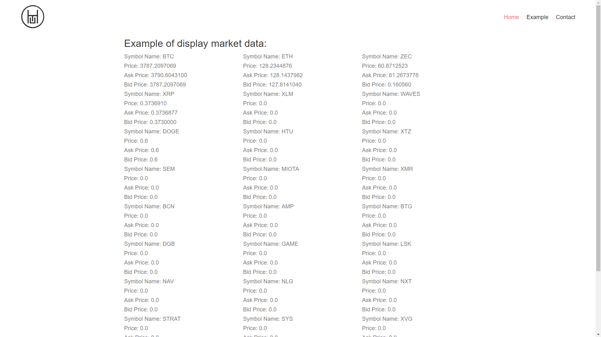

# ICTE Angular Base 
> ICTE-Angular-base provides HTML5 and JavaScript professionals to design and develop real-time applications for crypto currency and blockchain market.


## Required Software
Node.js 8.x
NPM 5.x

## Installation

1. Clone this repo: https://github.com/ICTEx/ICTE-Angular-base

```sh
git clone https://github.com/ICTEx/ICTE-Angular-base.git
```

or download: https://github.com/ICTEx/ICTE-Angular-base/archive/master.zip

2. Navigate to root directory and install dependencies Using NPM:

```sh
npm install 
```

## Run

After all dependecies are downloaded, run ng serve to lift the framework. This requires the Angular CLI installed, if you don't have it, you must install Angular CLI first:

```sh
npm i -g @angular/cli
```

```sh
ng serve
```

##How To display Crypto Market Data
In order to display crypto market data, we´ve created an angular service called: MarketDataService. In order to access market data, you must initialize this service from your code. The service is located under src/services/market-data-service.ts. You also need to import the base component and make your class inherit from Base Component.

```javascript
import { MarketDataService } from '../../services/market-data.service';
import { BaseComponent } from '../../base.components';

export class ExampleComponent extends BaseComponent {

constructor(protected service: MarketDataService) {
    super(service);
  }

}
```

Once you construct the library, we need to subscribe to the symbols which we want to get market data. This symbols are presented in an array format and you need to pass the array position of the desired symbol. The Symbol ID is provided along with the symbol name from ICTE MARKET DATA library. In order to enable symbols, we use changeSymbolStatus and pass the symbol ID.

```javascript
 this.s.changeSymbolStatus(1);

```


## How to Create your Own Components

ICTE Angular Web Framework provides an easy way to start working with Crypto Market Data. Develop your own visuals that relies on crypto market data and connect to our websocket connection that streams real-time data from major crypto exchanges.

```sh
ng g c components/fooBar
```

## Release History

* 0.0.1
    * Initial Open Source Release

## Contact

ICTE.io – pb@htu.io

Distributed under the MIT license. See ``LICENSE`` for more information.

[https://github.com/ICTEx/ICTE-Angular-base](https://github.com/ICTEx/ICTE-Angular-base)

## Contributing

1. Fork it (<https://github.com/ICTEx/ICTE-Angular-base/fork>)
2. Create your feature branch (`git checkout -b feature/fooBar`)
3. Commit your changes (`git commit -m 'Add some fooBar'`)
4. Push to the branch (`git push origin feature/fooBar`)
5. Create a new Pull Request

## License 
Copyright (c) 2018, HTU Technologies

Redistribution and use in source and binary forms, with or without
modification, are permitted provided that the following conditions are met:
* Redistributions of source code must retain the above copyright
notice, this list of conditions and the following disclaimer.
* Redistributions in binary form must reproduce the above copyright
notice, this list of conditions and the following disclaimer in the
documentation and/or other materials provided with the distribution.
* Neither the name of the HTU Technologies nor the
names of its contributors may be used to endorse or promote products
derived from this software without specific prior written permission.
The following conditions apply
1 library is minimized and uglified
2 no responsibility for data, own risk
3 use open source ng on any domain/subdomain
4 can add components, change size,font,css
5 header logo stays, footer logo stays
6 they have to monitor updates

THIS SOFTWARE IS PROVIDED BY THE COPYRIGHT HOLDERS AND CONTRIBUTORS "AS IS" AND
ANY EXPRESS OR IMPLIED WARRANTIES, INCLUDING, BUT NOT LIMITED TO, THE IMPLIED
WARRANTIES OF MERCHANTABILITY AND FITNESS FOR A PARTICULAR PURPOSE ARE
DISCLAIMED. IN NO EVENT SHALL HTU Technologies BE LIABLE FOR ANY
DIRECT, INDIRECT, INCIDENTAL, SPECIAL, EXEMPLARY, OR CONSEQUENTIAL DAMAGES
(INCLUDING, BUT NOT LIMITED TO, PROCUREMENT OF SUBSTITUTE GOODS OR SERVICES;
LOSS OF USE, DATA, OR PROFITS; OR BUSINESS INTERRUPTION) HOWEVER CAUSED AND
ON ANY THEORY OF LIABILITY, WHETHER IN CONTRACT, STRICT LIABILITY, OR TORT
INCLUDING NEGLIGENCE OR OTHERWISE) ARISING IN ANY WAY OUT OF THE USE OF THIS
SOFTWARE, EVEN IF ADVISED OF THE POSSIBILITY OF SUCH DAMAGE.
