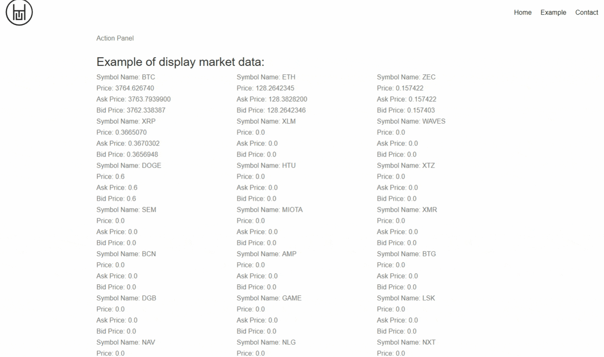

# ICTE Angular Base 
> ICTE-Angular-base provides HTML5 and JavaScript professionals to design and develop real-time applications for crypto currency and blockchain market.


## Get started

1. Download and install [Node.js (+npm)](https://nodejs.org/en/download/) (**8.12+**)
2. Clone this repository to a desired directory.
   ```sh
   git clone https://github.com/ICTEx/ICTE-Angular-base.git
   ```
3. Navigate to root directory and install dependencies using NPM:
   ```sh
   npm install
   ```
4. Install Angular CLI from NPM if not already installed
    ```sh
    npm install -g @angular/cli
    ```
5. Launch the framework to a web browser, Angular default port is 4200
    ```sh
    ng serve -o --port 4200
    ```

## How To display Crypto Market Data
In order to display crypto market data, we´ve created an angular service called: MarketDataService.
To access market data, you must initialize this service from your code.
Import the base component and make your class inherit from Base Component.

Go to the *component.ts* file of the component you wish to use MarketDataService with, and insert the following:
```javascript
import { MarketDataService } from '../../services/market-data.service';
import { BaseComponent } from '../../base.components';

export class ExampleComponent extends BaseComponent {
  constructor(protected service: MarketDataService) {
    super(service);
  }
}
```

Once you construct the library, we need to subscribe to the symbols which we want to get market data.
This symbols are presented in an array format and you need to pass the array position of the desired symbol.
The Symbol ID is provided along with the symbol name from ICTE MARKET DATA library.
In order to enable symbols, we use changeSymbolStatus and pass the symbol ID.

```javascript
 this.s.changeSymbolStatus(1);
```


## How to Create your Own Components

ICTE Angular Web Framework provides an easy way to start working with Crypto Market Data. Develop your own visuals that relies on crypto market data and connect to our websocket connection that streams real-time data from major crypto exchanges.

```sh
ng g c components/fooBar
```

## How to set your own header

ICTE Angular Web Framework can set a global header for your application or overwrite the current header at component execution. For this, we use dynamic component injection from Angular.

This is an example of how we set the header at component level

src/app/components/example-component.ts
```javascript

import { Component, OnInit } from '@angular/core';
import { ActionPanelService } from '../../services/action-panel.service'; //ActionPanelService is in charge of set and get dynamic components.
import { HeaderHomeComponent } from '../home/header-home/header-home.component'; // HeaderHome is the component we're going to set as header on component init.

@Component({
  selector: "app-example"
})

export class ExampleComponent implements OnInit {

  constructor ( protected apService: ActionPanelService) {

  }

  ngOnInit() {
    this.apService.setHeader(HeaderHomeComponent); // Set HeaderHome as header of the application when component init.
  }

}
```

After you create the component, declare the component as part of your entryComponents array in your app.module.ts

src/app/app.module.ts
```json
  entryComponents: [HeaderHomeComponent],
```


## How to set your own Action Panel

ICTE Angular Web Framework can set a global Action Panel (or navigation bar) for your application at component execution. For this, we use dynamic component injection from Angular.

This is an example of how we set the action panel component when component init.


```javascript

import { Component, OnInit } from '@angular/core';
import { ActionPanelService } from '../../services/action-panel.service'; //ActionPanelService is in charge of set and get dynamic components.
import { ExampleActionPanelComponent } from '../example/example-action-panel/example-action-panel.component'; // ExampleActionPanel is the component we're going to wwset as action panel on component init.

@Component({
  selector: "app-example"
})

export class ExampleComponent implements OnInit {

  constructor ( protected apService: ActionPanelService) {

  }

  ngOnInit() {
        this.apService.setActionPanel(ExampleActionPanelComponent); // Set ExampleActionPanel as header of the application when component init.
  }
  
}
```
After you create the component, declare the component as part of your entryComponents array in your app.module.ts

src/app/app.module.ts
```javascript
import { ExampleActionPanelComponent } from './components/example/example-action-panel/example-action-panel.component';

@NgModule({
  declarations: [
    ],
  imports: [
     ],
  entryComponents: [ExampleComponent]
  })
```

## How to set your own Footer

ICTE Angular Web Framework can set a global Footer for your application at component execution. For this, we use dynamic component injection from Angular.

This is an example of how we set the footer of our application when component init.


```javascript

import { Component, OnInit } from '@angular/core';
import { ActionPanelService } from '../../services/action-panel.service'; //ActionPanelService is in charge of set and get dynamic components.
import { FooterComponent } from '../footer/footer.component.ts'; // FooterComponent is the component we're going to set as footer on component init.

@Component({
  selector: "app-footer"
})

export class FooterComponent implements OnInit {

  constructor ( protected apService: ActionPanelService) {

  }

  ngOnInit() {
        this.apService.setFooter(FooterComponent); // Set ExampleActionPanel as header of the application when component init.
  }
  
}
```
After you create the component, declare the component as part of your entryComponents array in your app.module.ts

src/app/app.module.ts
```javascript
import { FooterComponent } from './components/footer/footer.component.ts';

@NgModule({
  declarations: [
    ],
  imports: [
     ],
  entryComponents: [FooterComponent]
  })
```

## TODO
1. Fix mobile navigation
2. Add missing crypto market data to libraries
3. Add more functional action panel examples

## Contact

ICTE.io – pb@htu.io

Distributed under the MIT license. See ``LICENSE`` for more information.

[https://github.com/ICTEx/ICTE-Angular-base](https://github.com/ICTEx/ICTE-Angular-base)

## Contributing

1. Fork it (<https://github.com/ICTEx/ICTE-Angular-base/fork>)
2. Create your feature branch (`git checkout -b feature/fooBar`)
3. Commit your changes (`git commit -m 'Add some fooBar'`)
4. Push to the branch (`git push origin feature/fooBar`)
5. Create a new Pull Request

## License 
Copyright (c) 2018, HTU Technologies

Redistribution and use in source and binary forms, with or without
modification, are permitted provided that the following conditions are met:
* Redistributions of source code must retain the above copyright
notice, this list of conditions and the following disclaimer.
* Redistributions in binary form must reproduce the above copyright
notice, this list of conditions and the following disclaimer in the
documentation and/or other materials provided with the distribution.
* Neither the name of the HTU Technologies nor the
names of its contributors may be used to endorse or promote products
derived from this software without specific prior written permission.
The following conditions apply
1 library is minimized and uglified
2 no responsibility for data, own risk
3 use open source ng on any domain/subdomain
4 can add components, change size,font,css
5 header logo stays, footer logo stays
6 they have to monitor updates

THIS SOFTWARE IS PROVIDED BY THE COPYRIGHT HOLDERS AND CONTRIBUTORS "AS IS" AND
ANY EXPRESS OR IMPLIED WARRANTIES, INCLUDING, BUT NOT LIMITED TO, THE IMPLIED
WARRANTIES OF MERCHANTABILITY AND FITNESS FOR A PARTICULAR PURPOSE ARE
DISCLAIMED. IN NO EVENT SHALL HTU Technologies BE LIABLE FOR ANY
DIRECT, INDIRECT, INCIDENTAL, SPECIAL, EXEMPLARY, OR CONSEQUENTIAL DAMAGES
(INCLUDING, BUT NOT LIMITED TO, PROCUREMENT OF SUBSTITUTE GOODS OR SERVICES;
LOSS OF USE, DATA, OR PROFITS; OR BUSINESS INTERRUPTION) HOWEVER CAUSED AND
ON ANY THEORY OF LIABILITY, WHETHER IN CONTRACT, STRICT LIABILITY, OR TORT
INCLUDING NEGLIGENCE OR OTHERWISE) ARISING IN ANY WAY OUT OF THE USE OF THIS
SOFTWARE, EVEN IF ADVISED OF THE POSSIBILITY OF SUCH DAMAGE.
